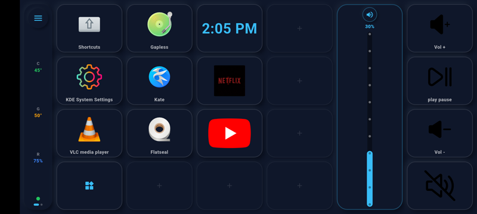
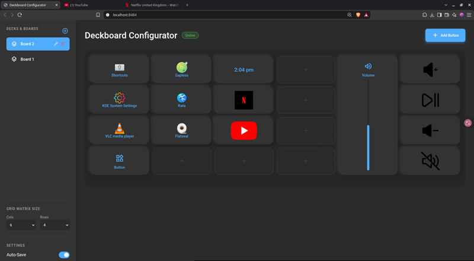
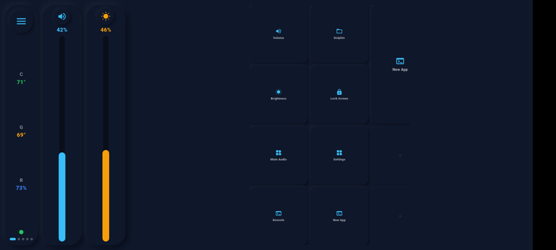

# KDE Deck 🚀

**Turn an old Android phone into a Stream Deck for Linux. $0.**

KDE Deck is an open-source macro pad / deck controller for **Linux (KDE Plasma 6, Wayland & X11)**. Instead of paying Elgato money, you run a lightweight server on your PC and drive it from your phone: launch apps, control media, slide volume and brightness, ring your phone, manage windows — a full remote for your Linux box, built from scratch.


*One tap on the phone opens YouTube on the monitor, media buttons drive playback and volume, and the last tap opens system settings.*

---

## 📸 Screenshots & Media

| Phone deck | Board configurator | Volume & brightness sliders |
|---|---|---|
|  |  |  |

---

## 🏗️ Architecture & Technologies

We recently migrated from a Python prototype to a highly robust **Dart and Flutter** ecosystem to ensure zero-latency WebSockets, beautiful UI animations, and native system integration without forcing users to install bulky runtime environments (like Node.js or Python virtual environments).

* **Backend Daemon:** Written in pure Dart. It compiles into a single, standalone AOT executable (`kdedeck_daemon`) with an incredibly small memory footprint. It natively manages D-Bus MPRIS controls and parses system/Flatpak `.desktop` application icons.
* **Frontend Mobile App:** A stunning **Neumorphic** Android application built with Flutter. It connects to the daemon via WebSockets and updates button matrix grids instantly.
* **Frontend Web App:** The daemon also hosts a Web UI at `http://localhost:8484` for dragging and dropping configurations directly on your PC.

---

## ⚡ Installation (For New Users)

**You do NOT need to install Dart, Flutter, Python, or any heavy SDKs to use KDE Deck.** 
We provide fully compiled, standalone binaries.

### 1. The Linux Backend
1. Download the compiled `kdedeck_daemon` executable.
2. Run it via your terminal or double-click it.
   ```bash
   ./kdedeck_daemon
   ```
3. The server will start silently on port `8484`.

To inspect the daemon release identity without starting a listener:

```bash
./kdedeck_daemon --version
```

### 2. The Android Frontend
1. Download the `app-release.apk` file to your Android phone.
2. Install the APK.
3. Open the app, slide open the menu, and enter your PC's IP address (e.g., `192.168.1.50`).

### 3. The Web Configurator
1. On your PC, open a web browser.
2. Navigate to `http://localhost:8484`.
3. Use the Drag & Drop interface to customize your button grid!

---

## 🌍 Cross-Platform Roadmap (Windows & macOS)

Are we bringing this to Windows and Mac? **Yes!** Our architecture is perfectly suited for it.

Because we built the mobile app in Flutter, the frontend is already 100% cross-platform compatible with iOS and Android. Because we built the backend in Dart, the server logic compiles natively into `.exe` (Windows) and Mach-O (macOS) binaries.

Currently, the backend's `SystemActionsService` uses Linux-specific commands (like `dbus-send` and parsing `/usr/share/applications`). In the near future, we will simply inject platform-specific branches into this single service:
* **Windows:** Parsing the Start Menu and hooking into the Windows Media API.
* **macOS:** Hooking into AppleScript for media controls.

The core server, UI, and WebSocket protocols will remain completely untouched!

---

## 🛠️ Building from Source

If you want to contribute to the code:
1. Ensure you have the Dart SDK and Flutter installed.
2. **Backend:** `cd deckboard_daemon/backend && dart compile exe bin/backend.dart -o kdedeck_daemon`
3. **Frontend:** `cd kdedeck_mobile && flutter build apk --release`

---

## 🌐 About & Website

KDE Deck is rapidly evolving. We are planning to host a dedicated documentation and showcase website! 

Because this repository is public, you can easily view our auto-generated project website hosted directly from this README via **GitHub Pages**. 
*(To enable this on your fork: Go to GitHub Repository Settings -> Pages -> Build and deployment -> Source: Deploy from a branch -> Select `main`).*

## License 📜
Distributed under the MIT License.
